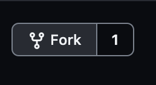
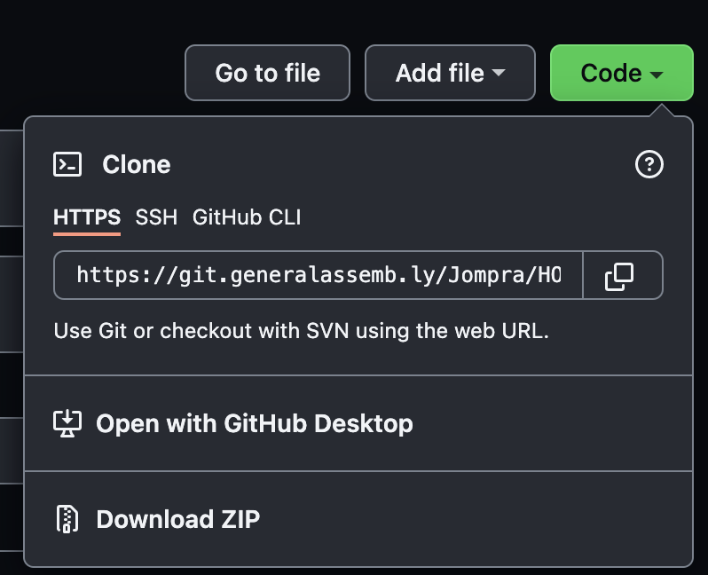
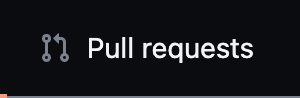
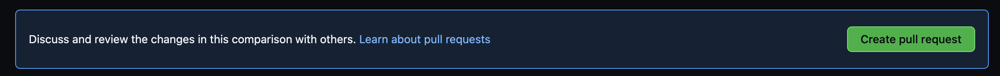
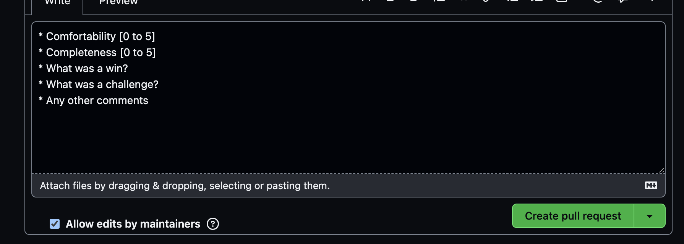

# SEI 04 Student Homework Repository

Welcome to the GA Bahrain SEI 04 student homework repository. This is the place we are going to monitor the completion of your homework deliverables.

## Setup

### Step 1. Fork the repository

First, [fork](https://help.github.com/articles/fork-a-repo) this repository by clicking the fork button.



### Step 2. Clone your fork

Next, clone your fork to your machine.



### Step 3. Create your directory

In the root folder, create a folder with your GitHub nickname.

```bash
.
├── README.md
└── GeorgeJones
```

## Submitting work

We will submit the first two deliverables together as a class. From this point onwards it will be down to you to submit them yourself.

### Step 1. Create a folder for the specific homework

```sh
cd GeorgeJones
mkdir js-calculator
```

Your folder structure should look something like this:

```
.
├── README.md
└── GeorgeJones
    └── js-calculator
```

### Step 2. Push to your fork

At the end of each day (or first thing each morning), ensure all of your homework is committed to git and pushed to your GitHub fork of the student work repository.

Do this with the following commands:
`git add .`
`git commit -m "A meaningful Commit message"`
`git push`

### Step 3. Submit a pull request

Then create a [pull request](https://help.github.com/articles/using-pull-requests) from your fork. This will automatically include all the commits you have made to the repository.

Click Pull Requests



Click New Pull Request


Click Create Pull Request




### Step 3. Add a title and comment

Add the title of homework to the pull request, e.g. "Javascript calculator w01d02".

Then add a comment to the pull request. Every comment should follow this format:

```
* Comfortability [0 to 5]
* Completeness [0 to 5]
* What was a win?
* What was a challenge?
* Any other comments
```
Click Create Pull Request


The instructional team will then review your pull request, and use the main repository as the source to monitor your work. If you do not issue a pull request, it will appear to us that you have not completed the assignments for the previous day, and it will be recorded as such.

If you have any problems with submitting assignments, ask the instructional staff to help you.
